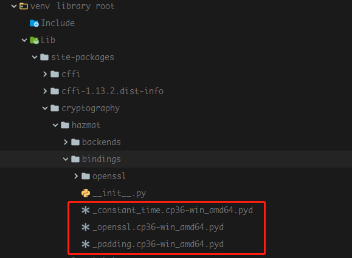

# cryptography

## 调用C库

cryptography 使用 cffi, 安装时使用 API 接口，调用头文件和对应的lib，生成动态库文件。

## 测试

`tox`

## 构建
 
### 生成安装包

`python setup.py sdist`  
生成文件 cryptography-2.9.dev1.tar.gz

### 编译 openssl 库

`set LIB=C:\OpenSSL-win64\lib;%LIB%`  
`set INCLUDE=C:\OpenSSL-win64\include;%INCLUDE%`  
`python setup.py build`
build 下生成对应文件

### 安装

`set LIB=C:\OpenSSL-win64\lib;%LIB%`  
`set INCLUDE=C:\OpenSSL-win64\include;%INCLUDE%`  
`python setup.py install`
build 下生成 `cryptography-2.9.dev1-py3.6-win-amd64.egg`并安装


### 使用 tox

`tox -e packaging` 生成安装包 `.tox\.tmp\package\2\cryptography-2.9.dev1.tar.gz`

查看安装包，可以看到，里面没有对应的 openssl 动态库文件

### 安装包编译安装
```
(venv) E:\learn\python\cryptography-example>"C:\Program Files (x86)\Microsoft Visual Studio 14.0\VC\vcvarsall.bat" x86_amd64

(venv) E:\learn\python\cryptography-example>set LIB=C:\OpenSSL-win64\lib;%LIB%

(venv) E:\learn\python\cryptography-example>set INCLUDE=C:\OpenSSL-win64\include;%INCLUDE%

(venv) E:\learn\python\cryptography-example>ls
cryptography-2.9.dev1.tar.gz  main.py  setup.py  venv

(venv) E:\learn\python\cryptography-example>pip install cryptography-2.9.dev1.tar.gz
Looking in indexes: http://mirrors.aliyun.com/pypi/simple/
Processing e:\learn\python\cryptography-example\cryptography-2.9.dev1.tar.gz
  Installing build dependencies ... done
  Getting requirements to build wheel ... done
    Preparing wheel metadata ... done
Requirement already satisfied: cffi!=1.11.3,>=1.8 in e:\learn\python\cryptography-example\venv\lib\site-packages (from cryptography==2.9.dev1) (1.13.2)
Requirement already satisfied: six>=1.4.1 in e:\learn\python\cryptography-example\venv\lib\site-packages (from cryptography==2.9.dev1) (1.13.0)
Requirement already satisfied: pycparser in e:\learn\python\cryptography-example\venv\lib\site-packages (from cffi!=1.11.3,>=1.8->cryptography==2.9.dev1) (2.19)
Building wheels for collected packages: cryptography
  Building wheel for cryptography (PEP 517) ... done
  Stored in directory: C:\Users\bigfish\AppData\Local\pip\Cache\wheels\01\5d\0a\31e82c2b027cae3951e336d482a085c84d3c063bb4fe0f7bdb
Successfully built cryptography
Installing collected packages: cryptography
Successfully installed cryptography-2.9.dev1
```

文件夹下会生成pyd文件
